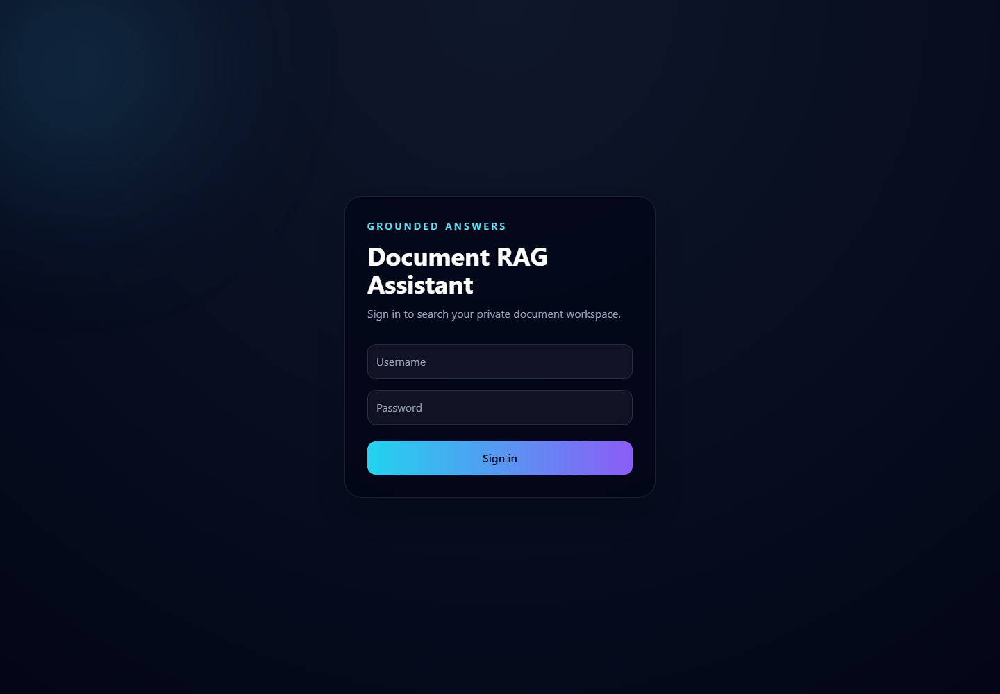

# Document RAG Assistant

A full-stack retrieval-augmented generation application for asking grounded questions about private documents or a supplied web page.

The assistant converts uploaded text into embeddings, ranks relevant chunks with cosine similarity, and streams an answer from a local Ollama model. Each response includes the source document names used to build its context.



## Features

- JWT-authenticated document workspace
- Upload, list, and delete user-owned documents
- Automatic text chunking and embedding generation
- Semantic retrieval with `all-MiniLM-L6-v2`
- Streaming responses from a local Ollama model
- Source attribution for retrieved document chunks
- URL-aware question mode
- OpenAPI schema and Swagger documentation
- Responsive React chat interface

## Architecture

```text
React client
    |
    v
Django REST API
    |
    +-- document storage
    +-- sentence-transformer embeddings
    +-- cosine-similarity retrieval
    +-- Ollama streaming generation
```

## Tech stack

- Backend: Python, Django, Django REST Framework
- Authentication: Simple JWT
- Retrieval: Sentence Transformers and NumPy
- Generation: Ollama
- Frontend: React, Tailwind CSS, Framer Motion
- API documentation: drf-spectacular

## Run locally

### Backend

```bash
python -m venv .venv
# Windows: .venv\Scripts\activate
# macOS/Linux: source .venv/bin/activate
pip install -r requirements.txt
copy .env.example .env
python manage.py migrate
python manage.py createsuperuser
python manage.py runserver
```

### Frontend

```bash
cd frontend
npm install
copy .env.example .env
npm start
```

Open `http://localhost:3000` and sign in with the Django user you created.

Ollama must be running locally with the configured model:

```bash
ollama pull llama3
ollama serve
```

## Environment variables

| Variable | Purpose | Default |
| --- | --- | --- |
| `DJANGO_SECRET_KEY` | Django signing key | development-only fallback |
| `DEBUG` | Enable debug mode | `True` |
| `ALLOWED_HOSTS` | Comma-separated hosts | `localhost,127.0.0.1` |
| `CORS_ALLOWED_ORIGINS` | Comma-separated client origins | local React URLs |
| `OLLAMA_URL` | Ollama generation endpoint | `http://localhost:11434/api/generate` |
| `OLLAMA_MODEL` | Generation model | `llama3` |
| `REACT_APP_API_BASE_URL` | Backend origin used by React | `http://127.0.0.1:8000` |

## API documentation

After starting Django:

- Swagger UI: `http://127.0.0.1:8000/api/docs/`
- OpenAPI schema: `http://127.0.0.1:8000/api/schema/`

## Verification

```bash
python manage.py check
python manage.py test

cd frontend
npm run build
```

## Current document support

The ingestion pipeline currently reads UTF-8 text files. PDF and DOCX extraction are natural next steps for the project.

